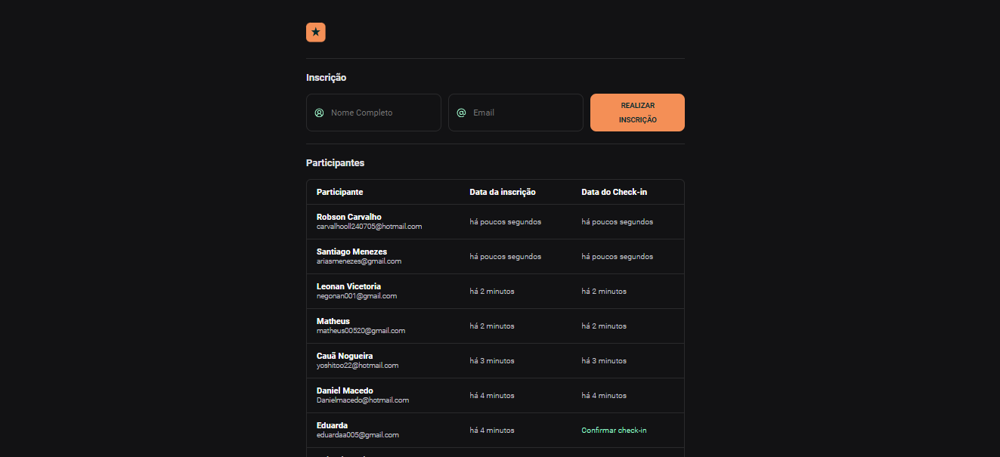

<h1 align="center"> Projeto A3. </h1>

Projeto foi feito em equipe, para realização de cadastro de participantes.

  <a href="#-tecnologias">Tecnologias</a>&nbsp;&nbsp;&nbsp;|&nbsp;&nbsp;&nbsp;
  <a href="#-projeto">Projeto</a>&nbsp;&nbsp;&nbsp;&nbsp;&nbsp;&nbsp;

  

 

  

 

<a href="https://thiagoads11.github.io/projeto-a3/" target="_blank">🔗 [clique aqui para acessar ao projeto]</a> 

##  Tecnologias

Esse projeto foi desenvolvido com as seguintes tecnologias:

- HTML
- CSS
- JavaScript
- Day.js para lidar com datas
- Git e Github

Ferramentas para realização dos testes:

-GTMETRIX 

## 💻 Projeto
  Esse projeto foi feito por nossa equipe para cadastro de participantes online.

---
